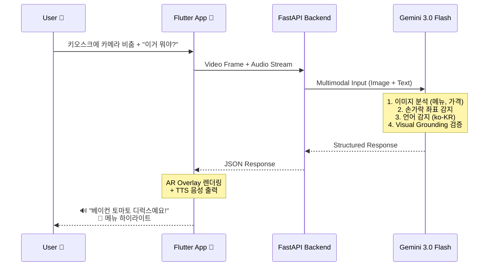

# GlassKiosk Copilot - Architecture Diagram

## System Overview

```
┌─────────────────────────────────────────────────────────────────────────────┐
│                              USER INTERACTION                                │
│  ┌─────────┐    "이거 뭐야?"     ┌─────────────┐                            │
│  │  User   │ ──────────────────▶ │  Kiosk      │                            │
│  │  👤     │    👆 pointing      │  Screen     │                            │
│  └────┬────┘                     └─────────────┘                            │
│       │                                                                      │
│       │ 📱 Camera + Voice                                                   │
│       ▼                                                                      │
│  ┌─────────────────────────────────────────┐                                │
│  │         FLUTTER MOBILE APP              │                                │
│  │  ┌───────────┐  ┌───────────────────┐   │                                │
│  │  │  Camera   │  │   AR Overlay      │   │                                │
│  │  │  Stream   │  │   (Highlight)     │   │                                │
│  │  └─────┬─────┘  └─────────▲─────────┘   │                                │
│  │        │                  │             │                                │
│  │  ┌─────▼──────────────────┴─────┐       │                                │
│  │  │      TTS Service             │       │                                │
│  │  │   (Multi-language Audio)     │       │                                │
│  │  └──────────────────────────────┘       │                                │
│  └──────────────────┬──────────────────────┘                                │
│                     │                                                        │
└─────────────────────┼────────────────────────────────────────────────────────┘
                      │
                      │ WebSocket / HTTP
                      │ (Video + Audio Stream)
                      ▼
┌─────────────────────────────────────────────────────────────────────────────┐
│                         GOOGLE CLOUD PLATFORM                                │
│                                                                              │
│  ┌───────────────────────────────────────────────────────────────────────┐  │
│  │                        CLOUD RUN (Docker)                             │  │
│  │  ┌─────────────────────────────────────────────────────────────────┐  │  │
│  │  │                     FASTAPI BACKEND                             │  │  │
│  │  │                                                                 │  │  │
│  │  │   ┌──────────────┐    ┌──────────────┐    ┌──────────────┐     │  │  │
│  │  │   │   /process   │    │   Vision     │    │   Language   │     │  │  │
│  │  │   │   -kiosk     │───▶│   Service    │───▶│   Service    │     │  │  │
│  │  │   │   Router     │    │              │    │              │     │  │  │
│  │  │   └──────┬───────┘    └──────────────┘    └──────────────┘     │  │  │
│  │  │          │                                                      │  │  │
│  │  └──────────┼──────────────────────────────────────────────────────┘  │  │
│  └─────────────┼─────────────────────────────────────────────────────────┘  │
│                │                                                             │
│                │ Gemini Live API                                            │
│                ▼                                                             │
│  ┌───────────────────────────────────────────────────────────────────────┐  │
│  │                     GEMINI 3.0 FLASH                                  │  │
│  │  ┌─────────────────────────────────────────────────────────────────┐  │  │
│  │  │                   Multimodal Processing                         │  │  │
│  │  │                                                                 │  │  │
│  │  │   📷 Image Analysis    👆 Gesture Detection    🗣️ NLU          │  │  │
│  │  │         │                      │                   │            │  │  │
│  │  │         └──────────────────────┴───────────────────┘            │  │  │
│  │  │                           │                                     │  │  │
│  │  │                    ┌──────▼──────┐                              │  │  │
│  │  │                    │   Visual    │                              │  │  │
│  │  │                    │  Grounding  │                              │  │  │
│  │  │                    │  (No 환각)   │                              │  │  │
│  │  │                    └─────────────┘                              │  │  │
│  │  └─────────────────────────────────────────────────────────────────┘  │  │
│  └───────────────────────────────────────────────────────────────────────┘  │
│                                                                              │
└──────────────────────────────────────────────────────────────────────────────┘
```

## Data Flow Diagram



## Response Schema Flow

```
┌─────────────────────────────────────────────────────────────────┐
│                        INPUT                                     │
│  ┌─────────────┐  ┌─────────────┐  ┌─────────────┐              │
│  │ Video Frame │  │ Audio       │  │ Finger      │              │
│  │ (Kiosk UI)  │  │ "이거 뭐야?" │  │ Coordinates │              │
│  └──────┬──────┘  └──────┬──────┘  └──────┬──────┘              │
│         └────────────────┼────────────────┘                      │
│                          ▼                                       │
│              ┌───────────────────────┐                          │
│              │   GEMINI PROCESSING   │                          │
│              └───────────┬───────────┘                          │
│                          ▼                                       │
│                        OUTPUT                                    │
│  ┌───────────────────────────────────────────────────────────┐  │
│  │ {                                                         │  │
│  │   "detected_language": "ko-KR",                          │  │
│  │   "target_item": "Bacon Tomato Deluxe",                  │  │
│  │   "confirmation_msg": "베이컨 토마토 디럭스...",           │  │
│  │   "coordinates": {"x": 450, "y": 120, ...},              │  │
│  │   "audio_response": "네, 가리키신 메뉴는...",             │  │
│  │   "status": "success"                                     │  │
│  │ }                                                         │  │
│  └───────────────────────────────────────────────────────────┘  │
└─────────────────────────────────────────────────────────────────┘
                          │
            ┌─────────────┼─────────────┐
            ▼             ▼             ▼
      ┌──────────┐  ┌──────────┐  ┌──────────┐
      │ AR Layer │  │   TTS    │  │  State   │
      │ Render   │  │  Output  │  │  Update  │
      └──────────┘  └──────────┘  └──────────┘
```

## Tech Stack Mapping

```
┌─────────────────────────────────────────────────────────────┐
│                      PRESENTATION LAYER                      │
│  ┌─────────────────────────────────────────────────────┐    │
│  │  Flutter Mobile App                                 │    │
│  │  • camera package (실시간 스트림)                    │    │
│  │  • flutter_tts (다국어 음성)                        │    │
│  │  • CustomPaint (AR 오버레이)                        │    │
│  └─────────────────────────────────────────────────────┘    │
└─────────────────────────────────────────────────────────────┘
                              │
                              ▼
┌─────────────────────────────────────────────────────────────┐
│                      APPLICATION LAYER                       │
│  ┌─────────────────────────────────────────────────────┐    │
│  │  FastAPI + Python 3.10+                             │    │
│  │  • google-genai SDK (Gemini 연동)                   │    │
│  │  • WebSocket (실시간 스트리밍)                       │    │
│  │  • Pydantic (스키마 검증)                           │    │
│  └─────────────────────────────────────────────────────┘    │
└─────────────────────────────────────────────────────────────┘
                              │
                              ▼
┌─────────────────────────────────────────────────────────────┐
│                      AI / INFERENCE LAYER                    │
│  ┌─────────────────────────────────────────────────────┐    │
│  │  Gemini 3.0 Flash (Multimodal Live API)             │    │
│  │  • Vision: UI 요소 인식, 좌표 추출                   │    │
│  │  • NLU: 다국어 의도 분석                            │    │
│  │  • Grounding: 환각 방지 검증                        │    │
│  └─────────────────────────────────────────────────────┘    │
└─────────────────────────────────────────────────────────────┘
                              │
                              ▼
┌─────────────────────────────────────────────────────────────┐
│                      INFRASTRUCTURE LAYER                    │
│  ┌─────────────────────────────────────────────────────┐    │
│  │  Google Cloud Platform                              │    │
│  │  • Cloud Run (서버리스 컨테이너)                     │    │
│  │  • Artifact Registry (Docker 이미지)                │    │
│  │  • GitHub Actions (CI/CD)                           │    │
│  └─────────────────────────────────────────────────────┘    │
└─────────────────────────────────────────────────────────────┘
```

## Deployment Pipeline

```
┌──────────┐    ┌──────────┐    ┌──────────────┐    ┌──────────┐
│  GitHub  │───▶│  GitHub  │───▶│  Artifact    │───▶│  Cloud   │
│  Push    │    │  Actions │    │  Registry    │    │  Run     │
└──────────┘    └──────────┘    └──────────────┘    └──────────┘
     │               │                 │                  │
     │          Build &            Docker             Deploy
     │          Test               Image              Container
     │               │                 │                  │
     └───────────────┴─────────────────┴──────────────────┘
                        CI/CD Pipeline
                      (보너스 점수 0.2점)
```
